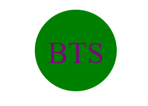
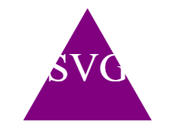

# 10-SVG-Logo-Creator

## Description
This project was created to help others create free logos. This was also a great opportunity to build on my node js skills and practice my skills with Jest.
During this project I learned that we can create shapes with our code and use that to create logos.

## Table of Contents
*[Installation](#installation)
*[Usage](#Usage)
*[License](#License)

## Installation
To run this application please follow the steps below:
1. Clone the code to your terminal
2. Once the code has been cloned, install node using the command npm i -y
3. Install inquirer using command install inquirer@8.2.4
4. Install Jest using command npm install --save-dev jest
5. Once all the required packages have been installed, use command node index.js to start the application.
6. Answer the prompts, once all prompts have been answered you will get a message that your logo is being generated.
7. You can right click on the logo.svg file and open in browser. Your logo will show there!

## Usage
Once all the required packages have been installed, use command node index.js to start the application.
Answer the prompts, once all prompts have been answered you will get a message that your logo is being generated.
You can right click on the logo.svg file and open in browser. 

Links:
Video:https://drive.google.com/file/d/1IRZTyeCtUkdq_A0THiAfuzmrQbRSpum_/view
GitHub:https://github.com/Volcomix13/10-SVG-Logo-Creator

## License

MIT licence, please see MIT section in repository for more details